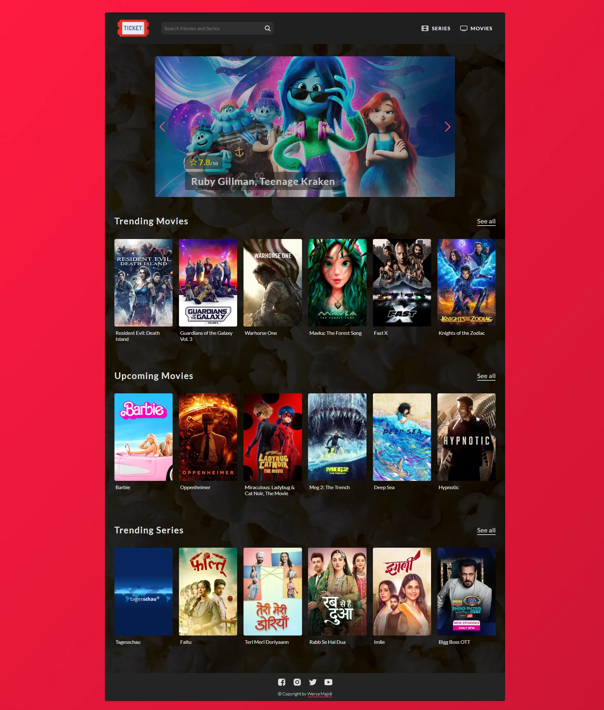

# 🎟 Ticket

### :page_facing_up: About

Movie and Series information Single Page Application (SPA).

This project was written in **HTML**, **Sass**, and **JavaScript** based on **MVC** architecture and **Responsive** design which, get the data from [**TMDB**](https://developers.themoviedb.org/3 "TMDB API") and [**OMDB**](https://www.omdbapi.com "OMDB API") APIs.

### :star2: Features

- Built with **HTML**, **sass**, and vanilla **JavaScript** based on **MVC** architecture
- **Fully responsive** design that adapts to different screen sizes and devices
- Connects with **TMDB** and **OMDB** APIs to fetch and display the trending movies and series
- Allows users to search for any movie or series and see its details, such as genre, rating, plot, etc.
- Shows a list of similar movies or series based on the user’s search query.
- Supports pagination to navigate different sections in the application
- Includes a menu to access different sections of the application

### :computer: Installation

1. Clone the repository `git clone https://github.com/weryamajidi/Ticket`
2. In the terminal run `npm install` to install all dependencies. 
3. Get your API_KEY from [TMDB](https://developers.themoviedb.org/3 "TMDB API") and [OMDB](https://www.omdbapi.com "OMDB API").
4. Add your KEYS to [config.js](https://github.com/weryamajidi/Ticket/blob/main/script/config.js) file.
5. Run `npm run build` to get the dist project for the run.

### :clapper: Live Demo
You can view a live demo of this project **[Here](https://ticket-wrry.netlify.app/)** 
➡️ To load faster please connect your VPN and then see the live demo.

